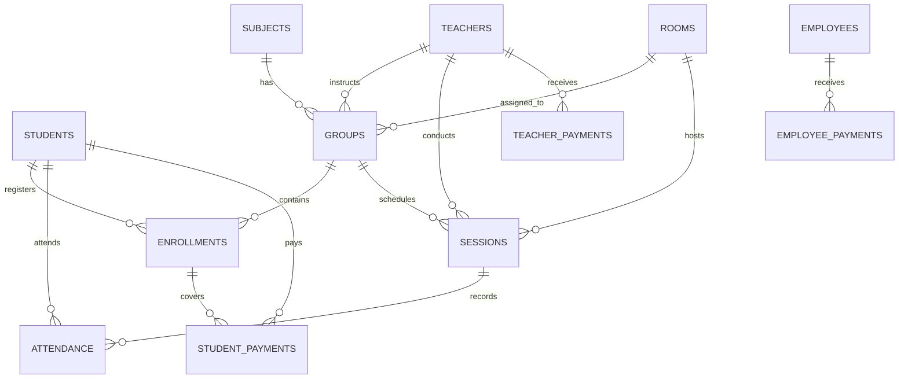

# Relational Schema Specification (Schema.md)

## 1. Domain Entities & Relational Map

## 2. Table Definitions (Target Supabase & In-Memory Store)
- **`students`**: `id (UUID/String)`, `first_name`, `last_name`, `full_name`, `dob`, `gender`, `phone`, `email`, `address`, `parent_name`, `parent_phone`, `parent_email`, `emergency_contact`, `registration_date`, `status`, `photo_url`, `notes`.
- **`teachers`**: `id`, `name`, `photo_url`, `phone`, `email`, `address`, `dob`, `hire_date`, `specialization`, `status`, `salary_type` (`fixed`, `per_session`, `hybrid`), `base_salary`, `per_session_rate`, `notes`.
- **`employees`**: `id`, `name`, `role`, `phone`, `email`, `hire_date`, `status`, `salary`, `payment_schedule`, `notes`.
- **`subjects`**: `id`, `name`, `description`, `category`, `color`, `monthly_price`, `duration`, `status`.
- **`groups`**: `id`, `name`, `subject_id`, `teacher_id`, `room_id`, `capacity`, `schedule_slots` (JSONB), `status`.
- **`enrollments`**: `id`, `student_id`, `subject_id`, `group_id`, `start_date`, `end_date`, `monthly_price`, `discount`, `final_price`, `status`, `payment_status`.
- **`rooms`**: `id`, `name`, `number`, `capacity`, `floor`, `building`, `type`, `equipment` (text array), `status`.
- **`sessions`**: `id`, `subject_id`, `group_id`, `teacher_id`, `room_id`, `date`, `start_time`, `end_time`, `duration_minutes`, `status`, `notes`.
- **`attendance`**: `id`, `session_id`, `student_id`, `status` (`Present`, `Absent`, `Late`, `Excused`), `notes`, `recorded_at`.
- **`student_payments`**: `id`, `student_id`, `enrollment_id`, `month`, `amount_due`, `amount_paid`, `remaining`, `payment_date`, `payment_method`, `status`, `notes`.
- **`teacher_payments`**: `id`, `teacher_id`, `month`, `base_amount`, `session_count`, `session_amount`, `bonuses`, `deductions`, `total_earned`, `amount_paid`, `remaining_amount`, `payment_date`, `status`.
- **`employee_payments`**: `id`, `employee_id`, `month`, `base_salary`, `bonuses`, `deductions`, `paid_amount`, `remaining_amount`, `payment_date`, `status`.
- **`expenses`**: `id`, `title`, `category`, `amount`, `date`, `payment_method`, `status`, `notes`.
